Recently, I've been digging deeper into how large language models (LLMs) actually work, including their underlying mechanism: transformers. Inside <span class="inline-tooltip" tabindex="0"><a href="https://en.wikipedia.org/wiki/Attention_Is_All_You_Need" target="_blank" rel="noopener noreferrer">the transformer paper</a><sup>?</sup><span class="tooltip-bubble">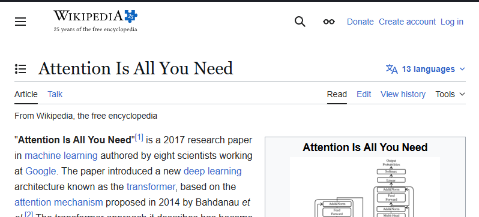</span></span>, there is a single word that caught my eye: Attention. This "Attention" word is special because it does not look like technical jargon—it's just an English word; there is no inherent technical meaning to it. In my field (software engineering), the jargons are much more specialized. As an example, we have latency, scalability, idempotence, and immutability. I don't think anyone would ever use those fancy words in a real and normal conversation. But "Attention", that's a common word that's well used in an everyday conversation. Since it's a normal-sounding word, it's hard to get the actual, intuitive sense of the meaning in terms of its technical machine learning usage. I want to visit my favourite online dictionary to understand the common usage:
<figure class="quote-block">
  <blockquote cite="https://www.vocabulary.com/dictionary/attention">
    "May I have your <strong>attention</strong> please?" When you ask that question, you are asking people to focus their mental powers on you. Whether they do or not depends on your next words. You'll have their full <strong>attention</strong> if you say, "Here's $100."
  </blockquote>
  <figcaption>
    Vocabulary.com, “Attention”
  </figcaption>
</figure>

The semantic meaning in conversation is easy enough to understand. Then, what does it have to do with LLM? Specifically, what makes this word special enough to become the first word of the transformer paper—Attention is all you need? Well, one way to find out is to read it.

In the <span class="inline-tooltip" tabindex="0"><a href="https://proceedings.neurips.cc/paper_files/paper/2017/file/3f5ee243547dee91fbd053c1c4a845aa-Paper.pdf" rel="noopener noreferrer" target="_blank">paper</a><sup>?</sup><span class="tooltip-bubble">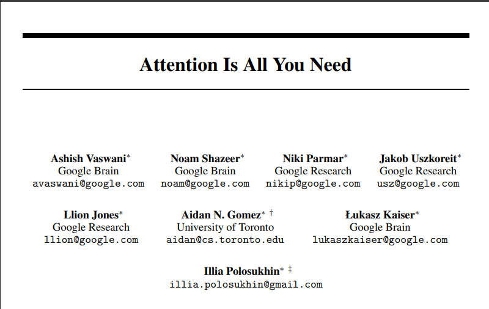</span></span>, the word "attention" appears 84 times, including four references:

1. *Yoon Kim, Carl Denton, Luong Hoang, and Alexander M. Rush.* Structured attention networks. *In International Conference on Learning Representations, 2017.*
2. *Samy Bengio, Łukasz Kaiser.* Can active memory replace attention? *In Advances in Neural Information Processing Systems (NIPS), 2016.*
3. *Minh-Thang Luong, Hieu Pham, and Christopher D. Manning.* Effective approaches to attention-based neural machine translation. *arXiv preprint arXiv:1508.04025, 2015.*
4. *Ankur Parikh, Oscar Täckström, Dipanjan Das, and Jakob Uszkoreit.* A decomposable attention model. *In Empirical Methods in Natural Language Processing, 2016.*

Among all of these references, the paper by <span class="inline-tooltip" tabindex="0"><a href="https://arxiv.org/pdf/1508.04025" target="_blank" rel="noopener noreferrer">Luong et al., 2015</a><sup>?</sup><span class="tooltip-bubble"></span></span> is written in 2015, the oldest of them all. This passage is taken from its introduction where it firstly mentions attention:

<figure class="quote-block">
  <blockquote cite="https://arxiv.org/pdf/1508.04025">
    In parallel, the concept of “attention” has gained popularity recently in training neural networks, allowing models to learn alignments between different modalities
  </blockquote>
  <figcaption>
    Effective Approaches to Attention-based Neural Machine Translation
  </figcaption>
</figure>

I don't think the paper explains the actual meaning of the term "attention" on its own. It explains that "attention" allows the model to learn better. But what is "attention"? This is the main question that I'm trying to find the answer to. The meaning of the word itself, not in relation to something else. Whenever attention is mentioned in the paper, it keeps being explained as either a mechanism, an architecture, or a model without any intuitive understanding of the actual word. This is probably by design; machine learning researchers have probably found the word "attention" to be so common that it doesn't need any specific explanation at all. Let me first go back to the transformer paper:

<figure class="quote-block">
  <blockquote cite="https://proceedings.neurips.cc/paper_files/paper/2017/file/3f5ee243547dee91fbd053c1c4a845aa-Paper.pdf">
    Attention mechanisms have become an integral part of compelling sequence modeling and transduction models in various tasks, allowing modeling of dependencies without regard to their distance in the input or output sequences [<a href="https://arxiv.org/abs/1409.0473" rel="noopener noreferrer" target="_blank">2</a>, <a href="https://arxiv.org/abs/1702.00887" target="_blank" rel="noopener noreferrer">16</a>]. In all but a few cases [<a href="https://arxiv.org/abs/1606.01933" target="_blank" rel="noopener noreferrer">22</a>], however, such attention mechanisms are used in conjunction with a recurrent network.
  </blockquote>
  <figcaption>
    Attention is all you need
  </figcaption>
</figure>

The paper mentions about attention but it's still a non-explanatory introduction. There are two ways I can go with this exploration: I'll keep digging until I found a clear-cut meaning of the word in the scope of machine learning or just accept this non-explanatory explanation and focus on the transformer paper, of which I may derive my own understanding of the word myself. I'm choosing the latter since I already have a decent understanding of the word in terms of linguistic conversational usage, and I can bridge it to the machine learning usage by seeing how it's actually used in <span class="inline-tooltip" tabindex="0"><a href="https://en.wikipedia.org/wiki/Attention_Is_All_You_Need" target="_blank" rel="noopener noreferrer">the transformer paper</a><sup>?</sup><span class="tooltip-bubble"></span></span>. I would quote what I think is the best summarization of this paper:

<figure class="quote-block">
  <blockquote cite="https://proceedings.neurips.cc/paper_files/paper/2017/file/3f5ee243547dee91fbd053c1c4a845aa-Paper.pdf">
    In this work we propose the Transformer, a model architecture <span class="inline-tooltip" tabindex="0"><a href="https://www.vocabulary.com/dictionary/eschewing" target="_blank" rel="noopener noreferrer">eschewing</a><sup>?</sup><span class="tooltip-bubble">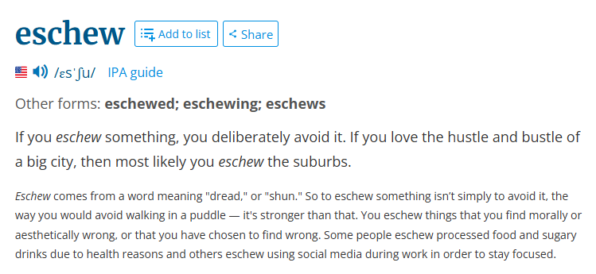</span></span> recurrence and instead relying entirely on an attention mechanism to draw global dependencies between input and output.
  </blockquote>
  <figcaption>
    Attention is all you need
  </figcaption>
</figure>

I highlighted the word "eschewing" because this word implies the major contribution of transformer is the usage of attention in place of recurrence. The previously quoted (<span class="inline-tooltip" tabindex="0"><a href="https://arxiv.org/pdf/1508.04025" target="_blank" rel="noopener noreferrer">Luong et al., 2015</a><sup>?</sup><span class="tooltip-bubble"></span></span>) paper is indeed using recurrent neural network (<span class="inline-tooltip" tabindex="0"><a href="https://en.wikipedia.org/wiki/Recurrent_neural_network" target="_blank" rel="noopener noreferrer">RNN</a><sup>?</sup><span class="tooltip-bubble">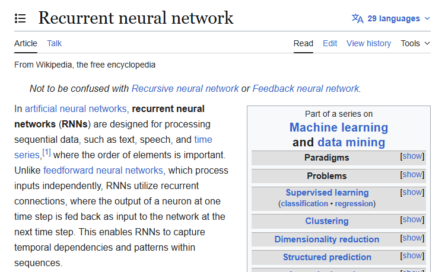</span></span>) as its main network architecture. In the abstract, the transformer paper also mentioned it also avoid using convolutions, which I assume referring to the convolutional neural network (<span class="inline-tooltip" tabindex="0"><a href="https://en.wikipedia.org/wiki/Convolutional_neural_network" target="_blank" rel="noopener noreferrer">CNN</a><sup>?</sup><span class="tooltip-bubble">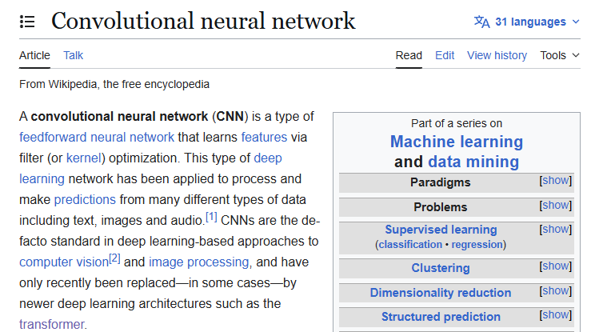</span></span>). So, I got the main idea of transformer: no to RNN, no to CNN, yes to attention. This main idea is still not explaining what attention is in itself, but its existence is justifiable by eliminating RNN (sequential—processing tokens in order) and CNN (looking at small pieces at a time) in the transformer architecture.

I'm getting increasingly close to digging into the mathematical explanation of Attention at this point—the Query-Key-Value model—but choose not to since it's not the focus of this article. So, ultimately, I did what a normal human would do: I went to <span class="inline-tooltip" tabindex="0">Google<sup>?</sup><span class="tooltip-bubble">Yes, I probably can just use chatbots, but I'm interested in exploring answers to a query, not the answer in itself.</span></span> search using "attention using rnn" query, scrolling some results, and I ended up in a <span class="inline-tooltip" tabindex="0"><a href="https://stackoverflow.com/questions/62233650/attention-mechanism-for-rnn" target="_blank" rel="noopener noreferrer">stackoverflow thread from 2020</a><sup>?</sup><span class="tooltip-bubble">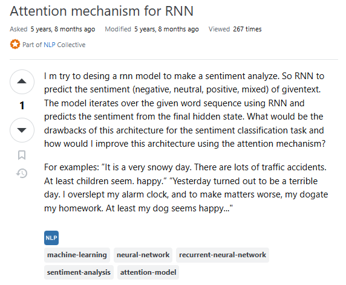</span></span>, which then brings me to a very specific <span class="inline-tooltip" tabindex="0">stackoverflow<sup>?</sup><span class="tooltip-bubble">I miss the days where stackoverflow is still active. It's not the best place to have a question, but repeatedly talking to a robot for my queries make me miss a real human conversation.</span></span> tag: <span class="inline-tooltip" tabindex="0"><a class="tag-button" href="https://stackoverflow.com/questions/tagged/attention-model" target="_blank" rel="noopener noreferrer">attention-model</a><sup>?</sup><span class="tooltip-bubble">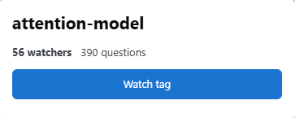</span></span>. It's not a very active tag, but I don't have better options. Since my goal is to understand Attention intuitively, I need a history lesson, so I pressed the last page of that tag, and found about a specific keyword that seems to come out often: `seq2seq` from tensorflow. I looked <span class="inline-tooltip" tabindex="0"><a href="https://www.tensorflow.org/text/tutorials/nmt_with_attention" target="_blank" rel="noopener noreferrer">it up</a><sup>?</sup><span class="tooltip-bubble">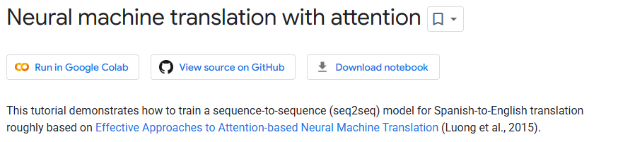</span></span>, and it ultimately brings me back to the <span class="inline-tooltip" tabindex="0"><a href="https://arxiv.org/pdf/1508.04025" target="_blank" rel="noopener noreferrer">Luong et al., 2015</a><sup>?</sup><span class="tooltip-bubble"></span></span> paper:


<figure class="quote-block">
  <blockquote cite="https://www.tensorflow.org/text/tutorials/nmt_with_attention">
    This tutorial demonstrates how to train a sequence-to-sequence (seq2seq) model for Spanish-to-English translation roughly based on Effective Approaches to Attention-based Neural Machine Translation (Luong et al., 2015). While this architecture is somewhat outdated, it is still a very useful project to work through to get a deeper understanding of sequence-to-sequence models and attention mechanisms (before going on to Transformers).
  </blockquote>
  <figcaption>
    Tensorflow.org tutorial: "Neural machine translation with attention"
  </figcaption>
</figure>

Interesting! The general idea of that paper is the implementation of attentional mechanism to translate text using RNN. The paper introduces two general architecture: Global and Local attention.

<div class="image-grid">
  <figure class="image-grid-full">
    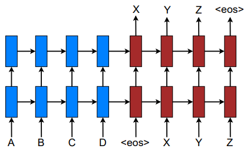
    <figcaption>
      Figure 1: Neural machine translation. Source: <span class="inline-tooltip" tabindex="0"><a href="https://arxiv.org/pdf/1508.04025" target="_blank" rel="noopener noreferrer">Luong et al., 2015</a><sup>?</sup><span class="tooltip-bubble"></span></span>
    </figcaption>
  </figure>
  <figure>
    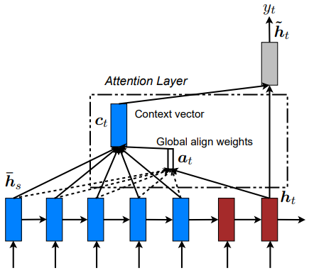
    <figcaption>
      Figure 2: Global attentional model. Source: <span class="inline-tooltip" tabindex="0"><a href="https://arxiv.org/pdf/1508.04025" target="_blank" rel="noopener noreferrer">Luong et al., 2015</a><sup>?</sup><span class="tooltip-bubble"></span></span>
    </figcaption>
  </figure>
  <figure>
    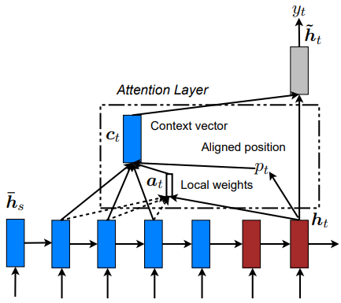
    <figcaption>
      Figure 3: Local attention model. Source: <span class="inline-tooltip" tabindex="0"><a href="https://arxiv.org/pdf/1508.04025" target="_blank" rel="noopener noreferrer">Luong et al., 2015</a><sup>?</sup><span class="tooltip-bubble"></span></span>
    </figcaption>
  </figure>
</div>

The `seq2seq` model is using an <span class="inline-tooltip" tabindex="0"><a href="https://www.tensorflow.org/text/tutorials/nmt_with_attention#the_encoderdecoder" target="_blank" rel="noopener noreferrer">encoder-decoder</a><sup>?</sup><span class="tooltip-bubble">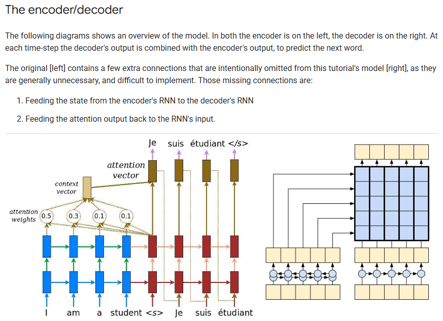</span></span> approach; the blue ones are there to express the encoding phase, while the red ones are for expressing the decoding phase. Figures 2 and 3 represent the global and local approaches of the attention mechanism for translating text, respectively. The global/local difference is akin to when I open my eyes whole vs when I squint my eyes to focus on to something. If I want to have a full picture of my surroundings, I open my eyes—my senses—to feel the whole surrounding area. If I want to focus on a specific part of the environment, I would use my eyes to stare at that point, and my brain will automatically filter unimportant informations unrelated to the thing that I want to focus on. I don't think the metaphor perfectly encapsulates the meaning that the author intends to convey, so I'd like to quote the explanation, which I'm happy to say is a well-articulated one:

<figure class="quote-block">
  <blockquote cite="https://arxiv.org/pdf/1508.04025">
    a <em>global</em> approach in which all source words are attended and a <em>local</em> one whereby only a subset of source words are considered at a time. 
  </blockquote>
  <figcaption>
    Effective Approaches to Attention-based Neural Machine Translation
  </figcaption>
</figure>

I love this explanation. Let me rephrase by saying global attention approach of a translation function is when the whole paragraph, the whole chunk of texts—can even be the whole book where the word is sourced from—are considered to get its semantic meaning while local attention is much more focused to just a few neighboring words. Intuitively, I can also say that the global attention function calculation is much more expensive than the local ones; basically a trade-off between resource (time, compute) and quality.

Now, I want to see if I can apply this intuitive understanding of Attention to something that is more familiar: AI-assisted programming. For this example, I would initiate a conversation to a chatbot that uses LLM—transformer—as its main driver. Let's try making a simple python script to handle a POST request. I'm using this query to initiate the conversation to the chatbot:

`"create a python post request handler of a login form"`

A very simple and straightforward query (or prompt). The full response is available <span class="inline-tooltip" tabindex="0"><a href="https://gist.github.com/mfakhrusy/3134f3bf40f7b6eedd1b488e65d4fb11" target="_blank" rel="noopener noreferrer">in my public github gist</a><sup>?</sup><span class="tooltip-bubble">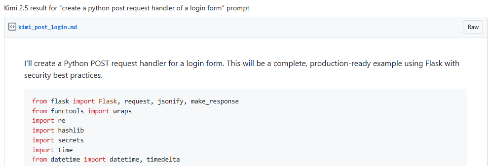</span></span>. The result is okay at the first glance, but I noticed something. I asked for a simple backend code, but the chatbot added a security-related text in its response unprompted. To verify whether the code is secure, I have to actually read it and check. But for this experiment, I'm going to pass the result to another chatbot instance with an added keywords of security-related text. The new query is also simple: `how secure is this code` plus the previously generated code.

The result is saved in <span class="inline-tooltip" tabindex="0"><a href="https://gist.github.com/mfakhrusy/df202afe19f25efcaf3a2fb726b0ed99" target="_blank" rel="noopener noreferrer">my other public github gist</a><sup>?</sup><span class="tooltip-bubble">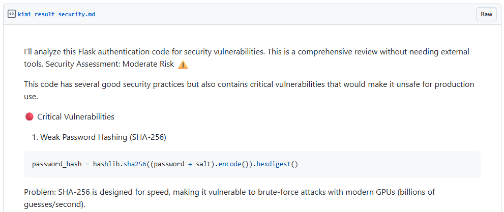</span></span>. Now, I'm going to do a simple manual review of the generated text and see if it can show me tell me whether the first generated text—the initial python script—is implemented with, in its own words, "security best practices."

The first vulnerability is the usage of SHA256 for password hashing. I agree because `argon2` or `bcrypt` is a standard practice for hashing a password due to its slowness—Yes, <span class="inline-tooltip" tabindex="0"><a href="https://security.stackexchange.com/questions/150620/what-is-the-purpose-of-slowing-down-the-calculation-of-a-password-hash" target="_blank" rel="noopener noreferrer">password hash computation need to be computationally slow</a><sup>?</sup><span class="tooltip-bubble">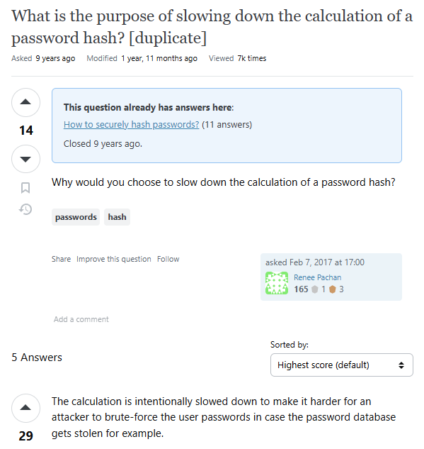</span></span>. The next one is a possible timing attack. Frankly, this is a <span class="inline-tooltip" tabindex="0">TIL<sup>?</sup><span class="tooltip-bubble">Today I learned</span></span> moment for me. I knew about the existence of timing-based attacks, but I couldn't quite understand it until I see this example:

```python
return hash_obj.hexdigest() == stored_hash
```

The above code is problematic because the equality string comparison will return as soon as it finds a mismatch. Therefore, theoretically, an attacker can enumerate a password hash by guessing and observing its timing result (a better implementation is available on my GitHub gist above). The last critical vulnerability is a hardcoded demo credentials, let's see the actual generated code about this:

```python
# Simulated user database (in production, use proper database)
# Passwords should be stored as properly salted hashes
USERS_DB = {
    'admin': {
        'password_hash': hashlib.sha256('admin123'.encode()).hexdigest(),  # Demo only - use bcrypt in production
        'salt': 'random_salt_here',
        'role': 'admin',
        'active': True
    },
    'user': {
        'password_hash': hashlib.sha256('user123'.encode()).hexdigest(),
        'salt': 'another_salt',
        'role': 'user',
        'active': True
    }
}
```

I have mixed feelings here. There is a comment, sure, but this comment will only be useful for anyone who understands what it means. If the whole script is copied-pasted directly, there is a chance that this part of the code may never be deleted. This may also be a limitation of a web-based AI-assisted programming; they may have a tendency to generate a single file text. To also be fair to the chatbot, `bcrypt` is also mentioned in the comment, but I would also argue that the implementation itself should be in `bcrypt` by default. Let me stop here with the code review since this is not the main intention of this article, so let's go back to Attention.

In my second query, I added a security-related text, and the resulted text is focused on the initial code's security aspect. People are saying this is "prompt engineering", and yes, in a way, it is, but I would also say this is a direct implementation of how attention works in practice. The attentional mechanism of the transformer guides the resulting text to lean towards generating security-related answers, which is very obvious at this point, since the whole "prompt engineering" niche is about guiding the result by adding a more related text to the query (prompt), but it's very interesting to know that Attention is the main driver of it! :)

<!-- I will stop the review there, other points are available on the github gist I posted above, and I generally agree with all of them! -->

<!-- And this is what Kimi generates: https://gist.github.com/mfakhrusy/3134f3bf40f7b6eedd1b488e65d4fb11 -->

<!-- 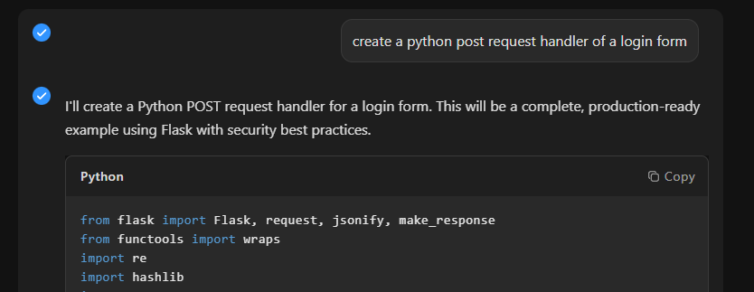 -->
<!-- <figure class="image-grid-full">
  
  <figcaption>
    Figure 4: A screenshot of our initial conversation about the creation of a POST request handler in python
  </figcaption>
</figure> -->


<!-- That is intuitive! Translation is a hard problem, not only we need to know the exact meaning of words, but we also need to know the semantic meaning of the word in its position of the sentence—the Attention mechanism. -->
<!-- 
Let me express my understanding of the Attention in my own words:

<figure class="quote-block">
  <blockquote cite="https://arxiv.org/pdf/1508.04025">
    Attention is a way to understand a certain entity—in language-translating case: words—according to its semantical positional understanding.
  </blockquote>
  <figcaption>
    Me
  </figcaption>
</figure> -->

<!-- 
<figure>
  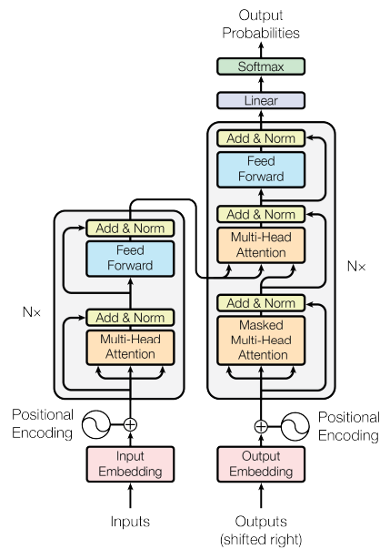
  <figcaption>
    Transformer model architecture from <span class="inline-tooltip" tabindex="0"><a href="https://proceedings.neurips.cc/paper_files/paper/2017/file/3f5ee243547dee91fbd053c1c4a845aa-Paper.pdf" target="_blank" rel="noopener noreferrer">Attention is all you need</a><sup>?</sup><span class="tooltip-bubble"></span></span>
    <br>
  </figcaption>
</figure>

Another term... yeay? Now it's not only "Attention" but "Multi-Head Attention."

I don't think I'm alone in this. This is a single reddit thread that I've encounted when I tried to make sense of Attention:


As you can see, Kimi stated that it will generate code "with security best practices." Are we sure about that? Let's ask Kimi again to review (huh? we can? Yes, thanks to Attention).

My prompt is simple, "how secure is this code" following by the full code that was generated before:

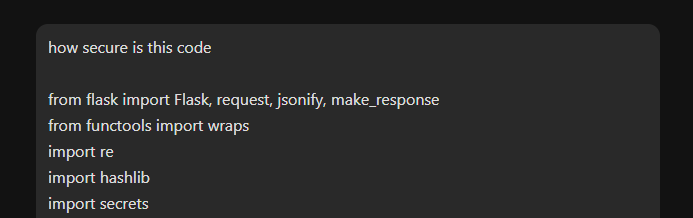

And this is the assessment generated by Kimi: https://gist.github.com/mfakhrusy/df202afe19f25efcaf3a2fb726b0ed99

Let me summarize the results
1. SHA256 for hashing: I agree, argon2 or bcrypt is a standard pracrice for password hashing due to its slowness—Yes, <a href="https://security.stackexchange.com/questions/150620/what-is-the-purpose-of-slowing-down-the-calculation-of-a-password-hash" target="_blank" rel="noopener noreferrer">password hash computation need to be slow.</a>
2. Timing attack: TIL moment for me, I read about timing attack, but I still didn't understand. In this case, the code

```python
return hash_obj.hexdigest() == stored_hash
```

is problematic because `hexdigest` will return as soon as it finds a mismatch—thanks again to Attention because I had to explicitly ask an LLM to explain this to me with the text "timing-based attack" included in my prompt.

3. Hardcoded demo credentials: I... am speechless, why do this code is generated in the first place? I assumed Kimi has some sort of internal prompt that add security-related details to any code it generates, I assumed this because my initial prompt did not add any security keyword, but Kimi answer it as though as I asked for it. So I am actually speechless that Kimi manages to create an admin password generated in the source code, maybe because it's designed to be written as a single file? I don't have the answer to that, unfortunately.

I will stop the review there, other points are available on the github gist I posted above, and I generally agree with all of them!

So let's go back to Attention, it's amazing. "prompt engineering" is actually the embodiment of this Attention mechanisms of a Transformer architecture of the LLM. Human designs a specific prompt for the <span class="inline-tooltip" tabindex="0">AI tools<sup>?</sup><span class="tooltip-bubble">ugh, I really don't know what should I address these tools: LLM? AI tools?? Transformer-based tools???</span></span> to achive specific results.

## Mathematics Definition of Attention

Woah, mathematics definition, really? Yes! I actually want to know more about Attention by looking into its mathematics definition, and see if I can understand it more. -->
