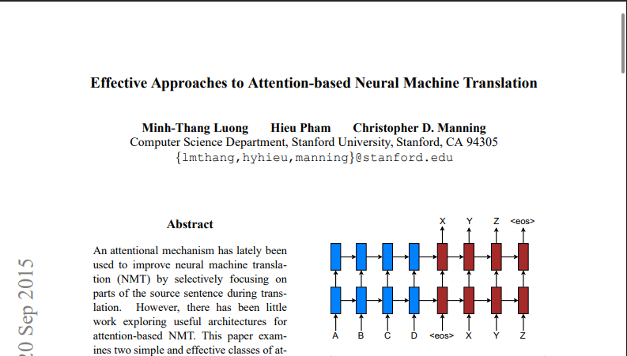

Update: Hey, it's 2026, I may change or alter my opinion now, but I'll keep this here for historical reasons! :)

I can't enjoy doing things people are doing. I can't enjoy the new paradigm of doing programming. I can't enjoy vibecoding. I currently have copilot in my local IDE, I use it, I have it enabled. But I just can't enjoy myself to keep using it. I use it, occasionally, if I'm too lazy to do something, like generating tests, but any other task, I don't think that's for me.

I kept seeing people saying they have their productivity increased by using IDEs like Cursor and Windsurf. I see a lot of claims in the internet: How one create a new software easily, or one able to boost their productivity by x times. Maybe it's true, maybe it's not. In my case, it's true to a sense, for example, again, when writing tests (I hate it).

One particular way that keep popping out in my social media feed is that, this new programming paradigm need a specific way to be done. For example, people usually have a specific rules in their IDE about how the AI should behave. I think they enjoyed it, they can even make good software with it, but I did programming because I like it, because I'm able to declare how my brain solve a particular problem in a systematic way. I love thinking, and I seems to remove that love for me.

That being said, I'm somehow hypocritical about it. I built this... seemingly simple blog with just HTML and CSS. And since I'm too lazy to initiate the project, I created the initial site using Gemini. I think that works well for me. This site is simple enough, and writing this manually doesn't express love in any way, and since it's also so easy to find a template in the public internet, I just decided to generate it.

This is the state of the site when I'm writing this (I screenshot it because I may update the template in the future):

<figure class="image-grid-full">
  
  <!-- <figcaption>
    Figure 1: Neural machine translation. Source: <a href="https://arxiv.org/pdf/1508.04025" target="_blank" rel="noopener noreferrer">Luong et al., 2015</a>?
  </figcaption> -->
</figure>

As you can see, I haven't even changed its title and it's a raw, unedited article since you probably see some mistakes in it.

Although the premise of the article is that I don't enjoy this new programming paradigm, but this site is a product of it. Hence, is this site not born out of love? Probably... This site is so simple I don't think I enjoy even the process of hand-writiting it, like I said above.

This feeling may also be a coping mechanism. I'm currently trying so hard to reject it. People are normalizing this new paradigm. The further I can go is to install Copilot because I got it for free (this copilot keep suggesting stuffs as I'm writing this). I may in the denial phase, but I may not, since I at least know a recent study that express [negativity toward AI-powered programming in terms of productivity](https://web.archive.org/web/20250711162101/https://metr.org/blog/2025-07-10-early-2025-ai-experienced-os-dev-study/).
